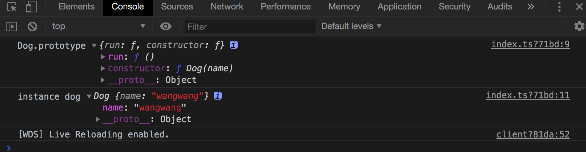

# class

## 类的基本实现

```ts
class Dog {
  constructor(name: string) {
    this.name = name;
  }

  name?: string;
  run() {}
}
console.log('Dog.prototype', Dog.prototype);

let dog = new Dog('wangwang');
console.log('instance dog', dog);
```

注意事项:

1. js 和 ts 中类成员的属性都是实例属性, 而不是原型属性;
   如下图 name 属性只在实例上
   

2. js 和 ts 中类成员的方法都是原型方法

ts 中与 js 中类不同的是, 实例的属性必需有初始值或在构造函数中被初始化, 如:

```ts
class Dog {
  constructor(name: string) {
    // this.name = name;  // 删除构造函数中的初始化
  }

  name: string = 'dog'; // 必须设置初始值
  run() {}
}
```

还可以声明为可选属性:

```ts
class Dog {
  constructor(name: string) {
    // this.name = name;
  }

  name?: string; // 声明为可选属性
  run() {}
}
```

## 类的继承

```ts
class Dog {
  constructor(name: string) {
    this.name = name;
  }

  name: string;
  run() {}
}

class Husky extends Dog {
  constructor(name: string, color: string) {
    super(name);

    this.color = color;
  }

  color: string;
}
```

## 类的成员修饰符 (ts 中 对 js 的扩展)

- public: 类的成员属性默认为 public
- private: 私有成员只能在类的本身使用, 不能被实例和子类使用
- protected: 受保护成员只能在类或子类中使用, 不能在实例中访问
- readonly: 只读属性不能被更新, 一定要被初始化
- static: 静态成员只能通过类名调用, 不能通过子类调用

```ts
class Dog {
  // private constructor() 构造函数加上私有属性, 表示既不能实例化也不能被继承
  // protected constructor() 表示此类不能被实例化, 只能被继承, 相当于声明了基类
  constructor(name: string) {
    this.name = name;
  }

  public name: string; // 类的成员属性默认为 public
  run() {}

  private pri() {} // 私有成员只能在类的本身使用, 不能被实例和子类使用

  protected pro() {} // 受保护成员只能在类或子类中使用, 不能在实例中访问

  readonly legs: number = 4; // 只读属性不能被更新, 一定要被初始化

  static food: string = 'bones'; // 静态成员只能通过类名调用, 不能通过子类调用
}

let dog = new Dog('wangwang');

// dog.pri() 实例不能调用私有成员

// dog.pro(); 实例不能调用受保护成员

Dog.food;
// dog.food; // 不能通过实例访问静态属性

class Husky extends Dog {
  // 构造函数参数与可以添加修饰符, 作用是将参数自动变成实例的属性, 这样可以省略在类中的定义
  // 即, 可以省略 this.color = color;
  // constructor(name: string, public color: string) {
  constructor(name: string, color: string) {
    super(name);

    this.color = color;
    // this.pri(); 子类不能调用私有成员
    this.pro(); // 子类中可以访问受保护成员
  }

  color: string;
}

Husky.food; // 静态成员可以被继承
```

## 抽象类

只能被继承, 无法被实例化.

```ts
abstract class Animal {
  // 直接实现某个方法
  eat() {
    console.log('animal eat');
  }

  // 定义抽象方法
  abstract sleep(): void;
}

// let animal = new Animal(); // 无法被实例化

class Dog extends Animal {
  constructor(name: string) {
    super();
    this.name = name;
  }

  name: string;
  run() {}

  // 实现抽象方法
  sleep() {
    console.log('dog sleep');
  }
}

let dog = new Dog('little dog');
dog.eat(); // 可以直接调用抽象类中的方法
dog.sleep();
```

## 抽象类 - 多态

```ts
class Cat extends Animal {
  sleep() {
    console.log('cat sleep');
  }
}

let cat = new Cat();

let animals: Animal[] = [dog, cat];
animals.forEach((i) => {
  // 通过多态特性访问不同方法
  i.sleep();
});
```

## 类与接口的关系

```ts
interface Human {
  // new (name: string): void; // 接口不能约束类的构造函数
  name: string;
  eat(): void;
}

class Asian implements Human {
  constructor(name: string) {
    this.name = name;
  }

  name: string;
  // private name: string; // 接口只能约束类的公有成员
  eat() {} // 接口必须实现接口的所有方法
  sleep() {} // 可以有多余的方法
}
```

接口可以继承多个接口

```ts
interface Human {
  name: string;
  eat(): void;
}
interface Man extends Human {
  run(): void;
}

interface Child {
  cry(): void;
}

interface Boy extends Man, Child {}

let boy: Boy = {
  name: '',
  run() {},
  eat() {},
  cry() {},
};
```

接口可以继承类

```ts
class Auto {
  state = 1;
}

interface IAuto extends Auto {}

class C implements IAuto {
  state = 1;
}
```
